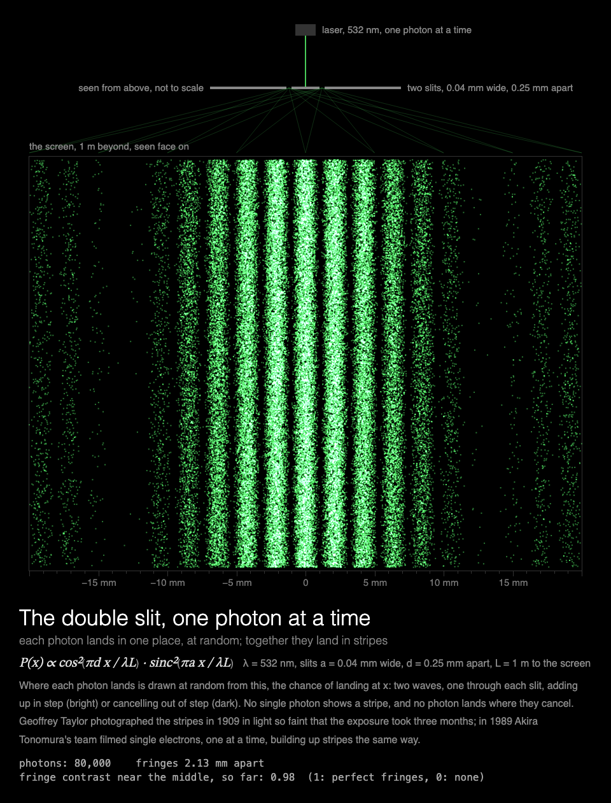

# MMM-DoubleSlit

A [MagicMirror²](https://magicmirror.builders/) module of the double-slit experiment done one photon at a time: dots that land at random build up interference fringes, and, when the slits are watched, lose them.



## What you see

**The double slit, one photon at a time.** At the top, the apparatus seen from above: a green
laser so faint that one photon crosses at a time, a barrier with two slits, and the screen a
metre beyond. Below, the screen seen face on. At first one photon lands at a time, each in one
place, at random; then faster and faster, until the dots have built up bright and dark stripes.
80,000 photons in 42 s, then the module rests on the picture.

In the next showing, **the double slit, watched**: a detector at each slit tells which way every
photon went. The same photons, one at a time, now build up one broad band with no stripes in it.

Under the picture: the chance of landing at each place, and what it means. The readout counts the
photons and measures, from the dots themselves, how clear the fringes are near the middle.

Built for a **Raspberry Pi 3 without GPU acceleration**: everything is drawn by the CPU, the dots are drawn one at a time at first and then in batches, so the canvas changes at most five times a second, and the module rests once the picture is done,
and the animation stops while the module is hidden (see [Performance](#performance)).

## Installation

```bash
cd ~/MagicMirror/modules
git clone https://github.com/charleswest775/MMM-DoubleSlit
```

No npm dependencies: there is nothing to install.

## Update

```bash
cd ~/MagicMirror/modules/MMM-DoubleSlit
git pull
```

## Configuration

```js
{
	module: "MMM-DoubleSlit",
	position: "middle_center",
	config: {
		simulations: ["doubleSlit", "whichPath"],  // in turn, one per showing
		width: 900,
		height: 900,
		fps: 20
	}
},
```

The two stories take turns **across showings**. The picture is done in 42 s, so a 45 s page
shows all of it.

| Option | Default | Description |
|---|---|---|
| `simulations` | `["doubleSlit", "whichPath"]` | The stories, one per showing, in turn: `doubleSlit` (nothing watched) and `whichPath` (a detector at each slit). `["doubleSlit"]` for the stripes every time |
| `cycleSeconds` | `60` | Start the next story this often; the next one also starts each time the module is shown again |
| `width`, `height` | `900` | Canvas size in pixels. The apparatus takes the top quarter (at most 230 px), the screen the rest |
| `fps` | `20` | Frame-rate cap |
| `showMath` | `true` | Equations and live numbers under the canvas |
| `turns` | `null` | Take turns with other modules on the same page, e.g. `{ of: 2, at: 1 }` (see [Taking turns](#taking-turns)) |
| `statsPanel` | `false` | A line under the math showing what the mirror spends: fps, CPU of Electron and the compositor, a bar per core, temperature. Sampled by the module's `node_helper` from `/proc`, only while the module is shown |
| `debugStats` | `false` | Show achieved fps and per-frame timings in the corner of the screen |

## Taking turns

With `turns: { of: n, at: k }`, modules on the same [MMM-pages](https://github.com/edward-shen/MMM-pages)
page each show on their own one in n showings of it: `at: 0` on the first showing and every
nth after it, `at: 1` on the second, and so on. A module that isn't on its turn takes no room on
the page and costs nothing: it hides its canvas and doesn't start. So one slot in the rotation
can hold several pages, without making the rotation longer. For example, two pages of quantum mechanics, [MMM-Atom](https://github.com/charleswest775/MMM-Atom)'s atom and the double slit:

```js
{
	module: "MMM-Atom",
	classes: "page-quantum",
	position: "middle_center",
	config: { turns: { of: 2, at: 0 } }
},
{
	module: "MMM-DoubleSlit",
	classes: "page-quantum",
	position: "middle_center",
	config: { turns: { of: 2, at: 1 } }
},
{
	module: "MMM-pages",
	config: { modules: [["page-clock"], ["page-quantum"]], rotationTime: 45000 }
},
```

Without `turns` the module shows every time. It works just as well on a page of its own, or in
a normal region without MMM-pages, where it starts again every `cycleSeconds`.

## What's real

Each photon's landing place across the screen is drawn at random, by rejection sampling (so
exactly), from the Fraunhofer pattern of two slits:

    P(x) ∝ cos²(π d x / λL) · sinc²(π a x / λL)

with λ = 532 nm (a green laser), slits a = 0.04 mm wide and d = 0.25 mm apart, and L = 1 m to the
screen: bright fringes every λL/d = 2.13 mm, inside a band whose first dark edge is λL/a = 13.3 mm
out. The far-field form holds: the Fresnel numbers a²/λL and d²/λL are 0.003 and 0.12. The slits
are long and the light spread along them, so up the screen a photon lands anywhere.

With the slits watched, each photon's path is known, the two ways through no longer interfere,
and the chances add instead of the waves: P(x) ∝ sinc²(π a x / λL), either slit's own pattern
(far from the slits both fall in the same place). One broad band, not two.

Geoffrey Taylor photographed the fringes in 1909 in light so faint that the exposure took three
months; in 1989 Akira Tonomura's team filmed single electrons building up fringes one at a time.
The fringe contrast in the readout is measured from the dots within two fringes of the middle,
binned by where in a fringe they fell: (most − least) / (most + least).

The tests check where the fringes and dark lines fall, that a histogram of 400,000 photons matches
the pattern's integral bin by bin, that the fringes share out exactly half the band's light, that
the measured contrast is near 1 with nothing watched and near 0 when watched, and that the page
lands its 80,000 photons in 42 s, changing the canvas at most five times a second.

## Performance

Measured on a Raspberry Pi 3 B+ (Electron 42, software rendering), 900×900 at 20 fps, as CPU of
the Electron processes plus the `cage` compositor, in % of one core (the Pi has four), traced a
quarter of a second at a time over a 45 s page; the mirror between pages: 0.2%.

| | % of one core |
|---|---|
| module **hidden** (e.g. another MMM-pages page) | 0.2 |
| `doubleSlit`, over a 45 s showing | 36 |
| `whichPath`, the same | 38 |

The apparatus is drawn once. The dots land all over the screen, so a batch changes most of the
canvas, but the canvas changes at most five times a second (at first, one photon at a time, each
a tiny change), and not at all once the picture is done at 42 s.

Why it is drawn this way, from micro-benchmarks on the Pi:

- There is no GPU acceleration to be had (the Pi 3's GPU only does GLES 2.0; Chromium needs
  3.0), so every pixel is drawn by the CPU.
- Any frame that changes the canvas costs ~2% of a core per fps, before drawing anything.
- On top of that, cost grows with the **area that changes**: Chromium redraws the bounding box
  of everything touched in a frame.
- The frame loop sleeps with `setTimeout` until a frame is due, capped at `fps`. Once the picture
  is finished the module rests, and is only polled twice a second. While MagicMirror² fades the
  module out, nothing new is drawn; once it is hidden, the loop stops.

## Development

```bash
node --test                  # the optics checks (no dependencies)
python3 -m http.server       # then open http://localhost:8000/dev/preview.html
```

`dev/preview.html` runs the module outside MagicMirror², in a portrait 1200×1920 frame, with
hide/show buttons that follow MagicMirror²'s suspend/resume order. Query options override the
config, e.g. `?simulations=whichPath`, `?height=1400` or `?statsPanel=true`.

## License

MIT

Part of a family of MagicMirror² modules. Chaos, one simulation each:
[MMM-LorenzAttractor](https://github.com/charleswest775/MMM-LorenzAttractor),
[MMM-DoublePendulum](https://github.com/charleswest775/MMM-DoublePendulum),
[MMM-FractalBasins](https://github.com/charleswest775/MMM-FractalBasins),
[MMM-LogisticMap](https://github.com/charleswest775/MMM-LogisticMap),
[MMM-SymmetricIcons](https://github.com/charleswest775/MMM-SymmetricIcons),
[MMM-ThreeBody](https://github.com/charleswest775/MMM-ThreeBody),
[MMM-ChaoticBilliards](https://github.com/charleswest775/MMM-ChaoticBilliards),
[MMM-Rule30](https://github.com/charleswest775/MMM-Rule30),
[MMM-StandardMap](https://github.com/charleswest775/MMM-StandardMap),
[MMM-ChaoticWaterwheel](https://github.com/charleswest775/MMM-ChaoticWaterwheel) and
[MMM-Sandpile](https://github.com/charleswest775/MMM-Sandpile), or all eleven in
one module, [MMM-ChaosTheory](https://github.com/charleswest775/MMM-ChaosTheory).
And more pages of physics and mathematics:
[MMM-Atom](https://github.com/charleswest775/MMM-Atom),
[MMM-FractalZoom](https://github.com/charleswest775/MMM-FractalZoom),
[MMM-Chladni](https://github.com/charleswest775/MMM-Chladni),
[MMM-SacredGeometry](https://github.com/charleswest775/MMM-SacredGeometry),
[MMM-Tilings](https://github.com/charleswest775/MMM-Tilings),
[MMM-PlanetsDance](https://github.com/charleswest775/MMM-PlanetsDance),
[MMM-Harmonograph](https://github.com/charleswest775/MMM-Harmonograph),
[MMM-SnowCrystal](https://github.com/charleswest775/MMM-SnowCrystal) and
[MMM-NightSky](https://github.com/charleswest775/MMM-NightSky).
